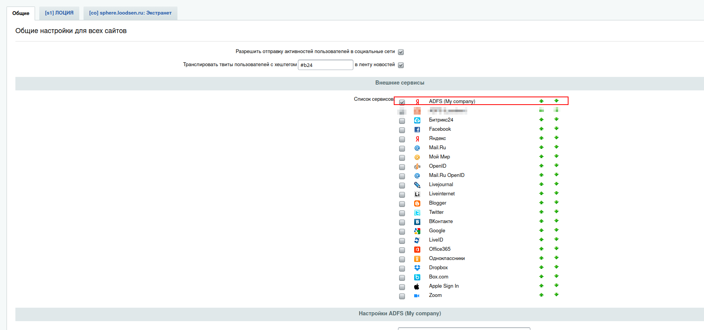
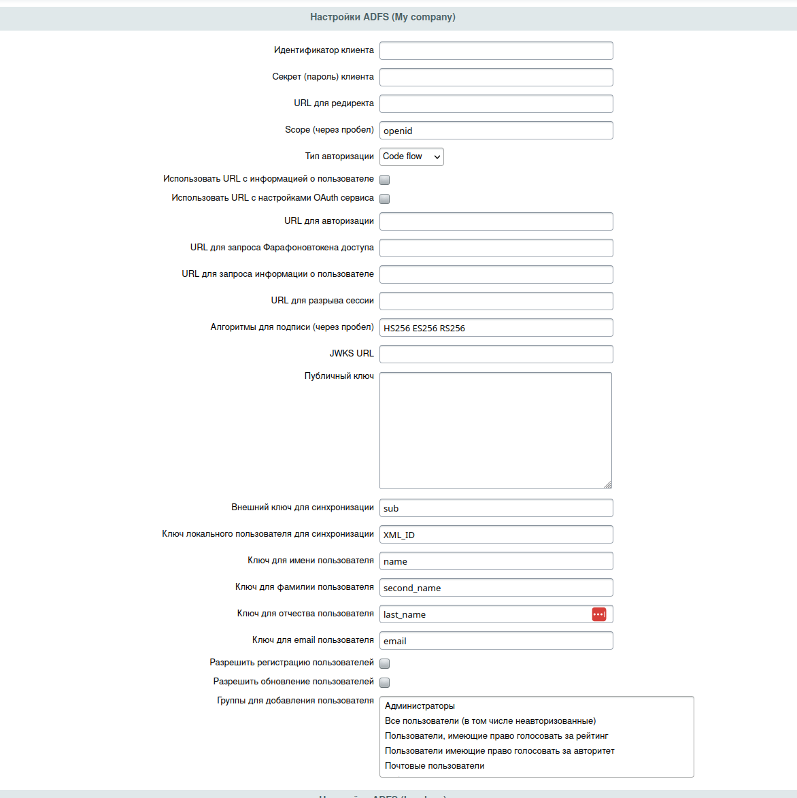

# Клиент для авторизации openid-connect

Для регистрации нового клиента авторизации необходимо в local/php_interface/init.php прописать след. код:

```php
use Bitrix\Main\EventManager;
use Bx\OpenId\SocServOpenId;

$eventManager = EventManager::getInstance();
$adfsSocService = SocServOpenId::createNewService(  // динамическое создание клиента
    'adfs',                 // идентификатор клиента авторизации
    'ADFS (My company)',    // название клиента выводимое в списке
    'adfs-icon'             // код класса для вывода иконки клиента в админке
);
$adfsSocService::selfRegister($eventManager); // регистрация клиента авторизации
```

После чего в админке (/bitrix/admin/settings.php?lang=ru&mid=socialservices&mid_menu=1) можно настроить клиент авторизации:




Помимо динамического создания клиента есть возможность описать свой класс:

```php
use Bx\OpenId\SocServOpenId;
use Bx\OpenId\interfaces\SocServOpenIdHandlerInterface;

class SocServAdfs extends SocServOpenId
{
    private static ?SocServOpenIdHandlerInterface $handler = null;
    
    static public function getId(): string
    {
        return 'adfs';
    }

    static public function getName(): string
    {
        return 'ADFS (My company)';
    }

    static public function getIconCode(): string
    {
        return 'adfs-icon';
    }
    
    static public function getHandler(): ?SocServOpenIdHandlerInterface
    {
        return static::$handler;
    }

    static public function setHandler(SocServOpenIdHandlerInterface $handler): void
    {
        static::$handler = $handler;
    }
}

// регистрация клента авторизации
$eventManager = EventManager::getInstance();
SocServAdfs::selfRegister($eventManager);
```

При необходимости можно изменить поведение клиента авторизации через внедрение обработчика.

Пример описания обработчика:

```php
use Bx\OpenId\BaseSocServiceHandler;

class CustomSocServiceHandler extends BaseSocServiceHandler 
{
    public function getAuthorizeCode(SocServOpenId $socServOpenId, ?HttpRequest $request = null): ?string
    {
        $request = $request ?? Context::getCurrent()->getRequest();
        $code = $request->get('custom_code_field') ?: null;
        return $code === null ? null : (string) $code;
    }
    
    public function getIdToken(SocServOpenId $socServOpenId, ?HttpRequest $request = null): ?string
    {
        $request = $request ?? Context::getCurrent()->getRequest();
        $code = $request->get('custom_id_token_field') ?: null;
        return $code === null ? null : (string) $code;
    }
}
```

Регистрация клиента авторизации с обработчиком:

```php
$handler = new CustomSocServiceHandler();
SocServAdfs::setHandler($handler);

$eventManager = EventManager::getInstance();
SocServAdfs::selfRegister($eventManager);
```